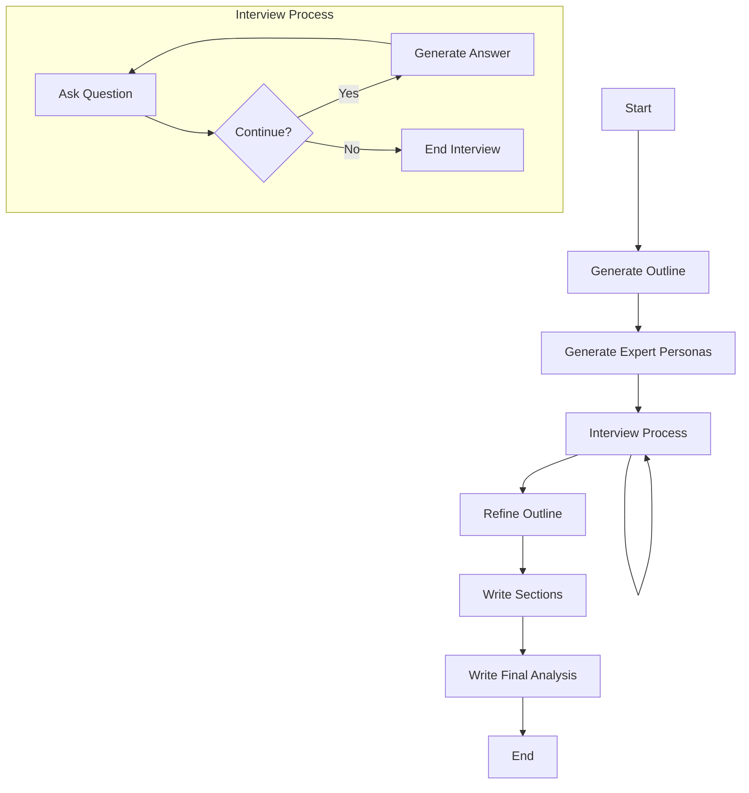

# AI Product Analysis CLI

## Overview

AI Product Analysis CLI is a powerful command-line tool that leverages advanced language models and a sophisticated graph-based approach to provide comprehensive analyses of AI products. This tool is designed for researchers, product managers, and AI enthusiasts who want to gain deep insights into various AI products and their potential impacts.

This project is inspired by the STORM (Synthesis of Topic Outlines through Retrieval and Multi-perspective) example from the LangChain library. You can find the original example here: [STORM Example](https://github.com/langchain-ai/langgraph/blob/main/examples/storm/storm.ipynb)

## Features

- Generates detailed outlines for AI product analysis
- Creates diverse expert personas for multi-perspective analysis
- Conducts simulated expert interviews using AI
- Refines analysis outlines based on gathered information
- Writes comprehensive sections for each aspect of the analysis
- Produces a final, detailed analysis report in Markdown format

## Installation

To install the AI Product Analysis CLI globally, use the following command:

```bash
pnpm add -g ai-product-analysis-cli
```

## Usage

After installation, you can use the CLI with the following command:

```bash
ai-product-analysis analyze "Product Name"
```

For example:

```bash
ai-product-analysis analyze "GPT-4"
```

You can also specify a custom thread ID for persistence:

```bash
ai-product-analysis analyze "GPT-4" --thread-id my-custom-thread-id
```

## How It Works

The AI Product Analysis CLI uses a sophisticated graph-based approach to generate comprehensive analyses, inspired by the STORM methodology. Here's a high-level overview of the process:



1. **Generate Outline**: Creates an initial structure for the analysis.
2. **Generate Expert Personas**: Develops diverse AI expert profiles for multi-perspective analysis.
3. **Conduct Interviews**: Simulates interviews with AI experts, using a nested graph structure:
   - Ask Question: Generates relevant questions based on the expert's profile.
   - Generate Answer: Provides informed responses using real-time web search.
   - This process continues until a satisfactory amount of information is gathered.
4. **Refine Outline**: Updates the initial outline based on the information from interviews.
5. **Write Sections**: Generates detailed content for each section of the analysis.
6. **Write Final Analysis**: Compiles all sections into a comprehensive, well-structured report.

## Configuration

Before using the CLI, make sure to set up your environment variables:

1. Create a `.env` file in your home directory.
2. Add the following variables:

```
OPENAI_API_KEY=your_openai_api_key
TAVILY_API_KEY=your_tavily_api_key
```

Replace `your_openai_api_key` and `your_tavily_api_key` with your actual API keys.

## Development

To set up the project for development:

1. Clone the repository:
   ```bash
   git clone https://github.com/yourusername/ai-product-analysis-cli.git
   cd ai-product-analysis-cli
   ```

2. Install dependencies:
   ```bash
   pnpm install
   ```

3. Build the project:
   ```bash
   pnpm run build
   ```

4. Run the CLI locally:
   ```bash
   node dist/main.js analyze "Product Name"
   ```

## Contributing

Contributions are welcome! Please feel free to submit a Pull Request.

## License

This project is licensed under the MIT License - see the [LICENSE](LICENSE) file for details.

## Disclaimer

This tool uses AI models and web search capabilities. The accuracy and completeness of the analysis depend on the available information and the performance of the underlying models. Always verify critical information from authoritative sources.

## Acknowledgements

This project is inspired by and adapts concepts from the STORM (Synthesis of Topic Outlines through Retrieval and Multi-perspective) example in the LangChain library. We are grateful to the LangChain team for their innovative work in the field of AI and language models. The original STORM example can be found at: [https://github.com/langchain-ai/langgraph/blob/main/examples/storm/storm.ipynb](https://github.com/langchain-ai/langgraph/blob/main/examples/storm/storm.ipynb)